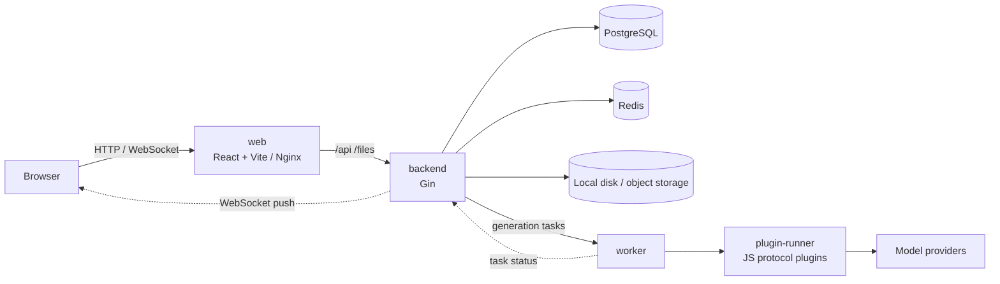

<p align="center">
  <picture>
    <source media="(prefers-color-scheme: dark)" srcset="docs/assets/brand/logo-dark.svg" />
    
  </picture>
</p>

<h1 align="center">连镜</h1>

<p align="center"><strong>Meaning lives between the shots.</strong></p>

<p align="center">From one sentence, to a whole film.<br />An open-source infinite canvas for AI video creation: chain text, image, video and audio generation together with nodes.</p>

<p align="center"><a href="README.md">简体中文</a> · <strong>English</strong></p>

<p align="center">
  <a href="CHANGELOG.md"></a>
  <a href="LICENSE"></a>
  <a href="https://github.com/zaylora/video-canvas/actions/workflows/ci.yml"></a>
  
  
</p>

> [!NOTE]
> 连镜 (pronounced _Lián Jìng_, "linked shots") is the product name. The logo is called "the light between shots": a beam of light passing between two camera brackets, just as the nodes on a canvas only tell a story once they are connected. The repository, Docker images and code identifiers are still named `video-canvas`.

> [!WARNING]
> This project is in early development. The API, canvas data format and configuration options may change in incompatible ways. It is not recommended for production use yet.


[Features](#features) · [Quick start](#quick-start) · [Architecture](#architecture) · [Documentation](#documentation) · [Roadmap](#roadmap) · [Contributing](#contributing)

## Features

- **Infinite canvas** — Node-based editing built on React Flow. Text, image, video and audio nodes can be connected, and the result of an upstream node can be used as a reference for downstream generation.
- **Asynchronous generation** — Submitting returns immediately and progress is pushed over WebSocket. Tasks can be cancelled; credits are frozen up front and refunded if a task fails or is cancelled.
- **Pluggable model providers** — Provider protocols are implemented as JS plugins that run in an isolated plugin-runner process. A NewAPI plugin is built in, and you can upload your own.
- **Model configuration console** — Models go live through "draft → validate → test run → publish" and can be rolled back to any earlier version. Channel keys are stored encrypted and are write-only: they can be set but never read back.
- **Asset storage** — Local disk is built in for development. In production, add Alibaba Cloud OSS / Tencent Cloud COS / AWS S3 / Cloudflare R2 under "Storage" in the admin console. You can configure several and pick a default; switching the default only affects new assets, and existing assets are always read from the storage they were written to.
- **Safe saving** — The canvas is saved with `revision`-based optimistic locking, so edits from multiple tabs or devices never overwrite each other.


## Quick start

### One-command deployment (Docker)

All you need on the server is [Docker](https://docs.docker.com/get-docker/) (with Compose v2) and curl. There is no need to clone the repository:

```bash
curl -fsSL https://raw.githubusercontent.com/zaylora/video-canvas/master/scripts/deploy.sh | bash
```

The script downloads `docker-compose.yml` into `video-canvas/` under the current directory, generates a `.env` with random secrets, pulls the images from GHCR and starts everything. When it is ready, open <http://localhost>.

To update to the latest version:

```bash
curl -fsSL https://raw.githubusercontent.com/zaylora/video-canvas/master/scripts/update.sh | bash
```

<details>
<summary>Custom port, domain and version; rolling back; things to know</summary>

```bash
# Custom port / public origin / pinned version / install directory
curl -fsSL https://raw.githubusercontent.com/zaylora/video-canvas/master/scripts/deploy.sh | bash -s -- \
  --port 8080 --origin https://canvas.example.com --tag 0.1.6 --dir /opt/video-canvas

# When updating, specify the directory, or roll back to a given version
curl -fsSL https://raw.githubusercontent.com/zaylora/video-canvas/master/scripts/update.sh | bash -s -- --dir /opt/video-canvas --tag 0.1.5
```

- If a `.env` already exists, the deploy script reuses it and does not regenerate secrets.
- Back up your `.env`: if `APP_AI_SECRET_KEY` is lost, the encrypted model and storage secrets can no longer be decrypted.
- If the service does not become healthy after updating to a specific version, the script automatically rolls back to the previous version.
- If the images are private, run `docker login ghcr.io` first.
- More production settings are in [Production Docker deployment](docs/docker-production.md) (Chinese).

</details>

### Docker development environment

```bash
git clone https://github.com/zaylora/video-canvas.git
cd video-canvas
./scripts/start-docker.sh  # On Windows run scripts/start-docker.bat; add -d to run in the background
```

The first build takes a few minutes. Once it is done:

| Service              | Address                                                      |
| -------------------- | ------------------------------------------------------------ |
| Frontend             | <http://localhost:5173>                                      |
| Backend health check | <http://localhost:8080/health>                               |
| PostgreSQL           | `localhost:15432` (postgres / root, database `video_canvas`) |
| Redis                | `localhost:16379`                                            |

### First-time setup: run your first generation

There are no models available right after startup, so you need to configure a few things first:

1. Open the frontend and register an account.
2. Promote that account to super admin (the first `super_admin` can only be set with SQL):

   ```bash
   # Docker deployment: run this in the deployment directory (video-canvas/ by default).
   # Dev environment: use `docker compose -f docker-compose.dev.yml` instead of `docker compose`.
   docker compose exec postgres \
     psql -U postgres -d video_canvas \
     -c "UPDATE users SET role = 'super_admin' WHERE username = 'your-username';"
   ```

   The role is cached for up to 30 seconds, so wait a moment and then refresh the page.

3. Go to **Admin console → Channels** (`/admin/ai/channels`) and create a channel: pick the built-in NewAPI plugin, fill in the address and API key, then click "Connectivity check".
4. Go to **Admin console → Models**, import models from the channel or create one, and publish it once validation passes.
5. Back on the home page, create a canvas, add a node, enter a prompt and start generating. New users get 50 credits by default.

## Local development

Without Docker you need: Go 1.27, [Bun](https://bun.sh) (npm also works), PostgreSQL 16 and Redis 7.

```bash
# Copy a local config if needed (it is gitignored) and adjust the database connection etc.
cp backend/configs/config.yaml backend/configs/config.local.yaml

./scripts/start.sh         # On Windows run scripts/start.bat; Ctrl+C stops both frontend and backend
```

The script builds the backend and starts Vite; the frontend proxies `/api` and `/files` to `:8080`. Every setting can be overridden with environment variables using the `APP_` prefix plus the upper-cased path, for example `APP_DATABASE_DSN`. Redis can be turned off with `redis.enabled: false`, in which case the cache layer falls back to querying the database directly.

## Architecture



| Layer       | Technology                                                                              |
| ----------- | --------------------------------------------------------------------------------------- |
| Frontend    | React 19 · TypeScript · Vite · Tailwind CSS 4 · shadcn/ui · React Flow · zustand        |
| Backend     | Go 1.27 · Gin · GORM · go-redis · Viper · Zap · goja                                    |
| Storage     | PostgreSQL 16 (required) · Redis 7 · local disk / object storage (OSS · COS · S3 · R2)  |
| Engineering | golangci-lint · oxlint / oxfmt · pre-commit · GitHub Actions · git-cliff                |

## Project layout

```text
video-canvas/
├── backend/        # Go backend: API, generation task worker, plugin-runner, built-in plugins
├── web/            # React frontend: canvas, canvas list, AI admin console
├── docs/           # Deployment docs, design docs, development plans
├── docker-compose.dev.yml / docker-compose.yml   # Development / production (GHCR images)
└── scripts/                                      # Deployment, startup and asset export scripts
```

## Production deployment

Pushing a `v*` tag makes CI build the `video-canvas-backend` and `video-canvas-web` images and publish them to GHCR. See [Quick start](#one-command-deployment-docker) for deploying and updating, and [Production Docker deployment](docs/docker-production.md) (Chinese) for the full configuration.

## Documentation

Most documents are currently written in Chinese.

| To learn about                           | Read                                                                                                    |
| ---------------------------------------- | ------------------------------------------------------------------------------------------------------- |
| Backend structure, config, full API list | [backend/README.md](backend/README.md)                                                                  |
| AI admin API, plugin contract            | [admin-ai-api.md](backend/docs/admin-ai-api.md) · [plugin-contract.md](backend/docs/plugin-contract.md) |
| Docker development / production          | [docker-development.md](docs/docker-development.md) · [docker-production.md](docs/docker-production.md) |
| Design documents                         | [docs/design/](docs/design/)                                                                            |
| Changelog                                | [CHANGELOG.md](CHANGELOG.md)                                                                            |

## Roadmap

- [x] Canvas project management with optimistic-lock saving
- [x] Text / image / video / audio nodes and asynchronous generation tasks
- [x] JS protocol plugins and the AI admin console
- [x] Local disk and object storage (Alibaba Cloud OSS · Tencent Cloud COS · S3 · Cloudflare R2), configurable in the admin console
- [ ] Canvas version control
- [ ] New node types such as director's desk and storyboard table
- [ ] Asset management
- [ ] Canvas Agent and skills management

## Contributing

Issues and pull requests are welcome. Please read these before submitting:

- Backend: [backend/AGENTS.md](backend/AGENTS.md) (hard rules) and the [coding standards](backend/docs/standards/README.md). `make fmt && make lint && make test` must all pass before you submit.
- Frontend: [web/docs/coding-standards.md](web/docs/coding-standards.md). Run `bun run typecheck && bun run lint && bun run format:check` before submitting.
- Use [Conventional Commits](https://www.conventionalcommits.org/en/v1.0.0/) for commit messages, for example `feat(canvas): support node grouping`.
- Installing the hooks is recommended: `pre-commit install`.

## License

[MIT](LICENSE)
