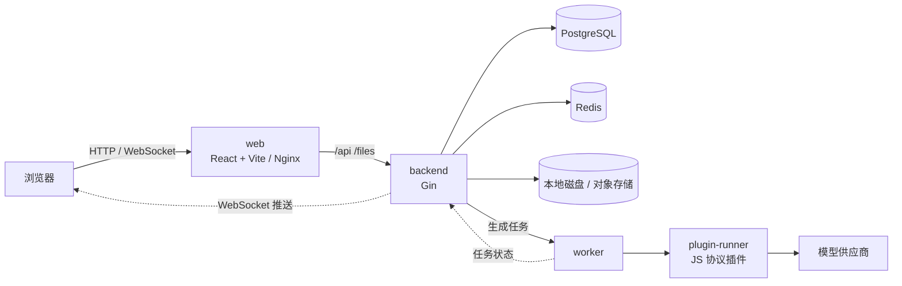

# video-canvas

开源的 AI 视频创作无限画布：用节点串联文本、图片、视频和音频生成。

[](CHANGELOG.md)
[](LICENSE)
[](https://github.com/zaylora/video-canvas/actions/workflows/ci.yml)


> [!WARNING]
> 项目处于早期开发阶段（v0.1.0），API、画布数据结构和配置项都可能有不兼容的变动，暂不建议用于生产。


[功能](#功能) · [快速开始](#快速开始) · [架构](#架构) · [文档](#文档) · [路线图](#路线图) · [参与贡献](#参与贡献)

## 功能

- **无限画布** — 基于 React Flow 的节点编辑。文本、图片、视频、音频节点之间可以连线，上游的结果可以作为下游生成的参考。
- **异步生成** — 提交后立即返回，进度通过 WebSocket 实时推送；任务可以取消，积分先冻结，失败或取消时退回。
- **插件化接入模型** — 供应商协议用 JS 插件实现，插件运行在隔离的 plugin-runner 进程中；内置 NewAPI 插件，也可以上传自己写的插件。
- **模型配置后台** — 模型按「草稿 → 校验 → 试跑 → 发布」上线，可以回滚到任意历史版本；渠道 Key 加密存储，只能写入，不能读出。
- **素材存储** — 开发时用内置的本地磁盘；生产环境在后台「存储配置」里添加阿里云 OSS / 腾讯云 COS / AWS S3 / Cloudflare R2，可建多套并指定默认，切换默认只影响新素材，旧素材始终从原存储读取。
- **安全保存** — 画布按 `revision` 乐观锁保存，多个标签页或设备同时修改时不会互相覆盖。


## 快速开始

### 一键部署（Docker）

服务器上只需要 [Docker](https://docs.docker.com/get-docker/)（带 Compose v2）和 curl，不用克隆仓库：

```bash
curl -fsSL https://raw.githubusercontent.com/zaylora/video-canvas/master/deploy.sh | bash
```

脚本会在当前目录的 `video-canvas/` 下载 `docker-compose.yml`，生成带随机密钥的 `.env`，拉取 GHCR 镜像并启动，就绪后打开 <http://localhost> 即可。

更新到最新版：

```bash
curl -fsSL https://raw.githubusercontent.com/zaylora/video-canvas/master/update.sh | bash
```

<details>
<summary>自定义端口、域名、版本，回退与注意事项</summary>

```bash
# 自定义端口 / 访问地址 / 固定版本 / 部署目录
curl -fsSL https://raw.githubusercontent.com/zaylora/video-canvas/master/deploy.sh | bash -s -- \
  --port 8080 --origin https://canvas.example.com --tag 0.1.6 --dir /opt/video-canvas

# 更新时指定目录，或回退到某个版本
curl -fsSL https://raw.githubusercontent.com/zaylora/video-canvas/master/update.sh | bash -s -- --dir /opt/video-canvas --tag 0.1.5
```

- 已有 `.env` 时部署脚本直接沿用，不会重新生成密钥。
- 请备份 `.env`：`APP_AI_SECRET_KEY` 丢失后，已加密保存的模型和存储密钥无法解密。
- 指定版本更新后服务没有恢复健康，会自动回滚到更新前的版本。
- 镜像为私有时，先执行 `docker login ghcr.io`。
- 更多生产配置见 [生产 Docker 部署](docs/docker-production.md)。

</details>

### Docker 开发环境

```bash
git clone https://github.com/zaylora/video-canvas.git
cd video-canvas
./start-docker.sh          # Windows 运行 start-docker.bat；加 -d 后台启动
```

首次构建需要几分钟。完成后：

| 服务         | 地址                                                    |
| ------------ | ------------------------------------------------------- |
| 前端         | <http://localhost:5173>                                 |
| 后端健康检查 | <http://localhost:8080/health>                          |
| PostgreSQL   | `localhost:15432`（postgres / root，库 `video_canvas`） |
| Redis        | `localhost:16379`                                       |

### 首次配置：完成第一次生成

刚启动时没有可用的模型，需要先完成以下配置：

1. 打开前端，注册一个账号。
2. 把这个账号提升为超级管理员（第一个 `super_admin` 只能用 SQL 设置）：

   ```bash
   # 一键部署的环境：在部署目录（默认 video-canvas/）执行；开发环境把 docker compose 换成 docker compose -f docker-compose.dev.yml
   docker compose exec postgres \
     psql -U postgres -d video_canvas \
     -c "UPDATE users SET role = 'super_admin' WHERE username = '你的用户名';"
   ```

   角色缓存最长 30 秒，稍等片刻后刷新页面。

3. 进入 **管理后台 → 渠道**（`/admin/ai/channels`），新建渠道：选择内置的 NewAPI 插件，填写地址和 API Key，然后点「连通性检查」。
4. 进入 **管理后台 → 模型**，从渠道导入或新建模型，校验通过后发布。
5. 回到首页新建画布，添加节点并输入提示词，开始生成。新用户默认有 50 积分。

## 本地开发

不用 Docker 时需要：Go 1.27、[Bun](https://bun.sh)（也可以用 npm）、PostgreSQL 16、Redis 7。

```bash
# 按需复制一份本机配置（已被 gitignore），修改数据库连接等
cp backend/configs/config.yaml backend/configs/config.local.yaml

./start.sh                 # Windows 运行 start.bat；Ctrl+C 同时停止前后端
```

脚本会编译后端并启动 Vite，前端会把 `/api` 和 `/files` 代理到 `:8080`。配置项都可以用环境变量覆盖，规则是 `APP_` + 大写路径，例如 `APP_DATABASE_DSN`。Redis 可以用 `redis.enabled: false` 关闭，关闭后缓存层会降级为直接查数据库。

## 架构



| 层   | 技术                                                                             |
| ---- | -------------------------------------------------------------------------------- |
| 前端 | React 19 · TypeScript · Vite · Tailwind CSS 4 · shadcn/ui · React Flow · zustand |
| 后端 | Go 1.27 · Gin · GORM · go-redis · Viper · Zap · goja                             |
| 存储 | PostgreSQL 16（必需）· Redis 7 · 本地磁盘 / 对象存储（OSS · COS · S3 · R2）      |
| 工程 | golangci-lint · oxlint / oxfmt · pre-commit · GitHub Actions · git-cliff         |

## 目录结构

```text
video-canvas/
├── backend/        # Go 后端：API、生成任务 worker、plugin-runner、内置插件
├── web/            # React 前端：画布、画布列表、AI 管理后台
├── docs/           # 部署文档、设计文档、开发计划
├── docker-compose.dev.yml / docker-compose.yml   # 开发 / 生产（GHCR 镜像）
├── deploy.sh / update.sh                         # 生产一键部署 / 更新
└── start*.sh / start*.bat                        # 开发一键启动脚本
```

## 生产部署

推送 `v*` tag 后，CI 会构建 `video-canvas-backend` 和 `video-canvas-web` 两个镜像并发布到 GHCR。部署和更新见[快速开始](#一键部署docker)，完整配置见 [生产 Docker 部署](docs/docker-production.md)。

## 文档

| 想了解                     | 看这里                                                                                                  |
| -------------------------- | ------------------------------------------------------------------------------------------------------- |
| 后端结构、配置、完整接口表 | [backend/README.md](backend/README.md)                                                                  |
| AI 管理接口、插件契约      | [admin-ai-api.md](backend/docs/admin-ai-api.md) · [plugin-contract.md](backend/docs/plugin-contract.md) |
| Docker 开发 / 生产         | [docker-development.md](docs/docker-development.md) · [docker-production.md](docs/docker-production.md) |
| 设计文档                   | [docs/design/](docs/design/)                                                                            |
| 变更记录                   | [CHANGELOG.md](CHANGELOG.md)                                                                            |

## 路线图

- [x] 画布项目管理与乐观锁保存
- [x] 文本 / 图片 / 视频 / 音频节点与异步生成任务
- [x] JS 协议插件与 AI 管理后台
- [x] 本地磁盘与对象存储（阿里云 OSS · 腾讯云 COS · S3 · Cloudflare R2），后台可配
- [ ] 画布版本控制
- [ ] 导演台、分镜表等新节点类型
- [ ] 资产管理
- [ ] 画布 Agent 与 skills 管理

## 参与贡献

欢迎提 Issue 和 PR。提交前请先阅读：

- 后端：[backend/AGENTS.md](backend/AGENTS.md)（硬性规则）和 [代码规范](backend/docs/standards/README.md)；提交前 `make fmt && make lint && make test` 都要通过。
- 前端：[web/docs/coding-standards.md](web/docs/coding-standards.md)；提交前运行 `bun run typecheck && bun run lint && bun run format:check`。
- 提交信息使用 [Conventional Commits](https://www.conventionalcommits.org/zh-hans/)，例如 `feat(canvas): 支持节点分组`。
- 推荐安装钩子：`pre-commit install`。

## License

[MIT](LICENSE)
