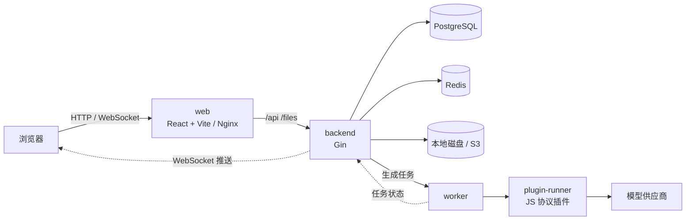

# 根目录 README 设计

> 设计面：其他 · 项目文档信息架构
> 日期：2026-10-01 · 对应版本：v0.1.0（`VERSION`）

## 1. 设计摘要

- **问题**：根目录 `README.md` 是空文件（0 字节）。GitHub 访客打开仓库看不到项目是什么、怎么跑起来；已有的说明分散在 `backend/README.md`、`docs/docker-*.md`、`backend/AGENTS.md` 里，`web/README.md` 还是 Vite 模板原文。
- **目标**：让第一次看到项目的开源访客在 30 秒内知道「这是什么」，在 10 分钟内用 Docker 跑起来并完成第一次生成。
- **推荐结论**：参照 Standard Readme 的章节顺序，结构借鉴 Dify 和 tldraw：主 README 写得精简，细节都链接到 `docs/`。用中文单份。顶部依次是一句话定位、徽章、早期状态提示和截图占位。快速开始以 Docker 为主，并补上「首次配置」一节（如果不配 super_admin 和模型渠道，画布无法生成内容，访客会卡在这一步）。路线图用勾选框区分已完成和计划中。License 用 MIT。

## 2. 项目现状

### 项目事实

| 事实                                                                                                                         | 证据                                                                                                                       |
| ---------------------------------------------------------------------------------------------------------------------------- | -------------------------------------------------------------------------------------------------------------------------- |
| 仓库是 monorepo：`backend/`（Go）+ `web/`（React），根目录有 Compose 和启动脚本                                              | 根目录结构；提交 `85e2b84`                                                                                                 |
| 后端：Go 1.27、Gin、GORM + PostgreSQL（仅支持 PG）、go-redis、Viper、Zap、JWT、goja（JS 插件）、minio-go（S3）               | `backend/go.mod`、`backend/AGENTS.md`                                                                                      |
| 前端：React 19、Vite 8、TypeScript 6、Tailwind 4、shadcn/Base UI、`@xyflow/react`、zustand，包管理器用 bun                   | `web/package.json`、`web/bun.lock`                                                                                         |
| 前端页面：登录、画布列表、画布详情、管理后台（AI 配置 / 用户管理 / 系统设置）                                                 | `web/src/router/index.tsx`、`web/src/pages/`                                                                               |
| 画布节点：文本、图片、视频、音频，外加生成任务节点                                                                           | `web/src/components/canvas/`（`TextCanvasNode`、`ImageCanvasNode`、`VideoCanvasNode`、`AudioCanvasNode`、`MediaTaskNode`） |
| 生成任务异步执行：提交后返回 202，通过 WebSocket 推送 `task.updated`；支持取消，积分会先冻结、取消后退回；新用户初始 50 积分 | `backend/README.md` 接口表；`service.DefaultInitialCredits`（后台「注册设置」可改）                                                |
| 模型接入通过 JS 协议插件，插件跑在独立的 plugin-runner 进程里；内置 `plugins/newapi.js`                                      | `backend/README.md`；`backend/plugins/`                                                                                    |
| 模型配置流程：草稿 → 校验 → dry-run / 试跑 → 发布 / 回滚                                                                     | `/api/v1/admin/ai/models/*`                                                                                                |
| 素材存储支持本地（仅开发用）和 S3 兼容存储（含 OSS）                                                                         | `backend/internal/storage/`                                                                                                |
| 画布保存用 `revision` 乐观锁，冲突时返回 409                                                                                 | `backend/AGENTS.md`、`service/canvas_project.go`                                                                           |
| 首个 `super_admin` 只能用 SQL 提升                                                                                           | `backend/README.md`                                                                                                        |
| Docker 开发环境：前端 `:5173`，后端 `:8080`，PG 对宿主机暴露 **15432**，Redis 暴露 **16379**                                 | `docker-compose.dev.yml`                                                                                                   |
| 本地直跑：`start.sh` / `start.bat` 编译后端、启动 Vite；优先读取 `config.local.yaml`；PG 默认连 `127.0.0.1:5432`             | `start.sh`、`backend/configs/config.yaml`                                                                                  |
| CI 覆盖前后端 lint / test；推送 `v*` tag 时发布两个 GHCR 镜像；CHANGELOG 由 git-cliff 生成                                   | `.github/workflows/`、`cliff.toml`                                                                                         |
| 仓库远程：`github.com/zaylora/video-canvas`；**没有 LICENSE 文件**                                                           | `git remote -v`                                                                                                            |

### 设计约束

- 所有文档、注释和提交信息都是中文，README 要保持一致（用户已确认）。
- README 不能把计划中的能力写成现状：导演台、分镜表、版本控制、资产管理、画布 Agent、skills 管理目前只出现在 `docs/plan/开发计划.md` 和 `docs/design/` 中。
- 后端接口表已经在 `backend/README.md` 里维护（`AGENTS.md` 第 9 步要求更新它）。根 README **不再复制接口表**，否则要维护两份。

### 当前缺口（写 README 时发现，只记录，未修改）

1. `docs/docker-development.md` 写的是 PG `localhost:5432`、Redis `localhost:6379`，和 `docker-compose.dev.yml` 实际映射的 `15432` / `16379` 不一致。
2. `docker-compose.prod.yml` 没有注入 `APP_SERVER_ID_KEY`，生产环境会沿用 `config.yaml` 里的默认值 `"id_key"`。按配置注释，这个值定下后不能再改，否则旧的画布 ID 全部失效，所以应在首次部署前设置好。
3. `web/README.md` 仍是 Vite 模板内容。
4. 缺少 `LICENSE`、`CONTRIBUTING.md` 和 README 截图素材。

## 3. 用户与场景

- **目标读者**：外部开源访客（用户已确认）。次要读者是要自部署的人和想参与贡献的开发者，他们由 README 分流到 `docs/`。
- **触发场景**：在 GitHub 上搜到项目或通过链接进入，带着「这是什么、能不能用、怎么试」的问题。
- **主任务**：看懂定位 → 看截图 → 用 Docker 启动 → 完成首次配置 → 在画布上生成第一个结果。
- **成功指标**（提案）：
  - 首屏（不滚动）能看到一句话定位、状态提示和主截图；
  - 只照 README 操作，在干净机器上 10 分钟内完成第一次生成，中途不需要看其他文件；
  - README 中每条功能都能对应到已有代码。

## 4. 调研范围

访问日期均为 2026-10-01。

| 参照                 | 来源                                                     | 观察到的做法                                                                                                                                             | 对本项目的启发                                                         | 不适用之处                                                                    |
| -------------------- | -------------------------------------------------------- | -------------------------------------------------------------------------------------------------------------------------------------------------------- | ---------------------------------------------------------------------- | ----------------------------------------------------------------------------- |
| Standard Readme 规范 | github.com/RichardLitt/standard-readme/blob/main/spec.md | 章节顺序：标题 → 横幅 → 徽章 → 短描述（<120 字符，与仓库描述一致）→ 背景 → 安装 → 使用 → 额外章节 → 贡献 → License（必须放最后）                         | 采用这个章节顺序；短描述同时用作 GitHub About                          | 规范要求必须有目录，但少于 100 行的 README 可以不放，本项目用一行锚点导航代替 |
| Dify                 | github.com/langgenius/dify                               | 封面图 + 导航链接 + 徽章；Quick start 先写最低配置，再给 4 行 Docker 命令和启动后要访问的地址；功能用加粗编号列表；高级配置拆到 `docs/ADVANCED_SETUP.md` | Docker 优先、写清前置条件、写清启动后访问哪个地址；把部署细节拆到 docs | 18 种语言的 README、社区徽章墙和 Star History 对 v0.1.0 来说太重              |
| tldraw               | github.com/tldraw/tldraw                                 | Hero 图 + 一句话标语 + Docs · Examples 链接；功能用「粗体关键词 — 一句话」；本地开发只有两段说明加两个代码块；不逐个介绍子包，改为链接                   | 功能写法、简短的本地开发说明、子目录用链接分流                         | 客户墙和 starter kits 不适用                                                  |

**比较结论**（摘取与本项目相关的维度）：

| 维度     | Standard Readme   | Dify                   | tldraw           | 本方案取用                      |
| -------- | ----------------- | ---------------------- | ---------------- | ------------------------------- |
| 首屏信息 | 标题 + 短描述     | 大图 + 大量徽章        | 图 + 标语 + 链接 | 标语 + 少量徽章 + 状态提示 + 图 |
| 快速开始 | 安装 / 使用代码块 | Docker 4 行 + 访问地址 | 包管理器 2 行    | Docker 为主，另加首次配置       |
| 文档分流 | 未规定            | 大量外链               | 外部文档站       | 链接到仓库内 `docs/`            |
| 维护成本 | 低                | 高                     | 中               | 低：不复制接口表，只做链接      |

## 5. 设计原则

1. **只写已实现的能力**：每条功能都能指到代码；计划中的内容只出现在路线图里，并用 `[ ]` 标出。（约束：不把占位当现状）
2. **一条路径跑通**：快速开始必须覆盖到「第一次生成成功」，不能停在「页面打开了」。（观察：首次使用要提权、配渠道、发布模型，少一步画布就用不了）
3. **README 做导航，docs 放细节**：接口、规范、部署、设计都只链接，不复制。（Dify / tldraw 的做法；避免和 `backend/README.md` 重复）
4. **首屏回答「是什么」和「能不能用」**：一句话定位、早期状态提示和截图都放在第一屏。
5. **命令能直接复制运行**：端口、账号、路径以 Compose 和配置文件为准，不照抄可能过时的文档。

## 6. 推荐方案

### 信息架构（从上到下）

1. 标题 + 一句话定位（同时用作 GitHub About）
2. 徽章：版本、License、CI、Go、React（5 个以内）
3. 早期状态提示（引用块）
4. 主截图占位 + 锚点导航
5. 功能亮点（6 条，「粗体关键词 — 一句话」）
6. 快速开始（Docker）→ 首次配置
7. 本地开发（不用 Docker）
8. 架构（Mermaid 图）+ 技术栈
9. 目录结构（只到一级子目录）
10. 生产部署（摘要 + 链接）
11. 文档索引
12. 路线图（勾选框）
13. 参与贡献
14. License

### 素材约定

| 文件                                 | 内容                                                                      |
| ------------------------------------ | ------------------------------------------------------------------------- |
| `docs/assets/readme/canvas-hero.png` | 画布主图：几个已连线的节点，至少有一个视频节点显示了生成结果，1600×900    |
| `docs/assets/readme/generate.gif`    | 从添加节点、写提示词、提交到结果出现的完整过程，15 秒以内，体积不超过 5MB |
| `docs/assets/readme/admin.png`       | AI 管理后台的模型编辑页                                                   |

注意：`.pre-commit-config.yaml` 中的 `check-added-large-files` 会拦截超过 1024KB 的文件，GIF 需要压缩，或改用 MP4 外链。

### README 草稿

以下内容可以直接写入根目录 `README.md`。图片路径是占位，素材补齐后即可显示。

````markdown
# video-canvas

开源的 AI 视频创作无限画布：用节点串联文本、图片、视频和音频生成。

[](CHANGELOG.md)
[](LICENSE)
[](https://github.com/zaylora/video-canvas/actions/workflows/ci.yml)


> [!WARNING]
> 项目处于早期开发阶段（v0.1.0），API、画布数据结构和配置项都可能有不兼容的变动，暂不建议用于生产。


[功能](#功能) · [快速开始](#快速开始) · [架构](#架构) · [文档](#文档) · [路线图](#路线图) · [参与贡献](#参与贡献)

## 功能

- **无限画布** — 基于 React Flow 的节点编辑。文本、图片、视频、音频节点之间可以连线，上游的结果可以作为下游生成的参考。
- **异步生成** — 提交后立即返回，进度通过 WebSocket 实时推送；任务可以取消，积分先冻结，失败或取消时退回。
- **插件化接入模型** — 供应商协议用 JS 插件实现，插件运行在隔离的 plugin-runner 进程中；内置 NewAPI 插件，也可以上传自己写的插件。
- **模型配置后台** — 模型按「草稿 → 校验 → 试跑 → 发布」上线，可以回滚到任意历史版本；渠道 Key 加密存储，只能写入，不能读出。
- **素材存储** — 开发时用本地磁盘，生产环境可接 S3 兼容存储（含阿里云 OSS）。
- **安全保存** — 画布按 `revision` 乐观锁保存，多个标签页或设备同时修改时不会互相覆盖。


## 快速开始

需要 [Docker](https://docs.docker.com/get-docker/)（带 Compose v2）。

```bash
git clone https://github.com/zaylora/video-canvas.git
cd video-canvas
./start-docker.sh          # Windows 运行 start-docker.bat；加 -d 后台启动
```

首次构建需要几分钟。完成后：

| 服务         | 地址                                                    |
| ------------ | ------------------------------------------------------- |
| 前端         | <http://localhost:5173>                                 |
| 后端健康检查 | <http://localhost:8080/health>                          |
| PostgreSQL   | `localhost:15432`（postgres / root，库 `video_canvas`） |
| Redis        | `localhost:16379`                                       |

### 首次配置：完成第一次生成

刚启动时没有可用的模型，需要先完成以下配置：

1. 打开前端，注册一个账号。
2. 把这个账号提升为超级管理员（第一个 `super_admin` 只能用 SQL 设置）：

   ```bash
   docker compose -f docker-compose.dev.yml exec postgres \
     psql -U postgres -d video_canvas \
     -c "UPDATE users SET role = 'super_admin' WHERE username = '你的用户名';"
   ```

   角色缓存最长 30 秒，稍等片刻后刷新页面。

3. 进入 **管理后台 → 渠道**（`/admin/ai/channels`），新建渠道：选择内置的 NewAPI 插件，填写地址和 API Key，然后点「连通性检查」。
4. 进入 **管理后台 → 模型**，从渠道导入或新建模型，校验通过后发布。
5. 回到首页新建画布，添加节点并输入提示词，开始生成。新用户默认有 50 积分。

## 本地开发

不用 Docker 时需要：Go 1.27、[Bun](https://bun.sh)（也可以用 npm）、PostgreSQL 16、Redis 7。

```bash
# 按需复制一份本机配置（已被 gitignore），修改数据库连接等
cp backend/configs/config.yaml backend/configs/config.local.yaml

./start.sh                 # Windows 运行 start.bat；Ctrl+C 同时停止前后端
```

脚本会编译后端并启动 Vite，前端会把 `/api` 和 `/files` 代理到 `:8080`。配置项都可以用环境变量覆盖，规则是 `APP_` + 大写路径，例如 `APP_DATABASE_DSN`。Redis 可以用 `redis.enabled: false` 关闭，关闭后缓存层会降级为直接查数据库。

## 架构



| 层   | 技术                                                                             |
| ---- | -------------------------------------------------------------------------------- |
| 前端 | React 19 · TypeScript · Vite · Tailwind CSS 4 · shadcn/ui · React Flow · zustand |
| 后端 | Go 1.27 · Gin · GORM · go-redis · Viper · Zap · goja                             |
| 存储 | PostgreSQL 16（必需）· Redis 7 · 本地磁盘 / S3 兼容存储                          |
| 工程 | golangci-lint · oxlint / oxfmt · pre-commit · GitHub Actions · git-cliff         |

## 目录结构

```text
video-canvas/
├── backend/        # Go 后端：API、生成任务 worker、plugin-runner、内置插件
├── web/            # React 前端：画布、画布列表、AI 管理后台
├── docs/           # 部署文档、设计文档、开发计划
├── docker-compose.dev.yml / docker-compose.prod.yml
└── start*.sh / start*.bat   # 一键启动脚本
```

## 生产部署

推送 `v*` tag 后，CI 会构建 `video-canvas-backend` 和 `video-canvas-web` 两个镜像并发布到 GHCR。部署时使用 `docker-compose.prod.yml`，至少要设置 `POSTGRES_PASSWORD`、`APP_JWT_SECRET`、`APP_AI_SECRET_KEY` 和 `APP_SERVER_ALLOWED_ORIGINS`。完整步骤见 [生产 Docker 部署](docs/docker-production.md)。

## 文档

| 想了解                     | 看这里                                                                                                  |
| -------------------------- | ------------------------------------------------------------------------------------------------------- |
| 后端结构、配置、完整接口表 | [backend/README.md](backend/README.md)                                                                  |
| AI 管理接口、插件契约      | [admin-ai-api.md](backend/docs/admin-ai-api.md) · [plugin-contract.md](backend/docs/plugin-contract.md) |
| Docker 开发 / 生产         | [docker-development.md](docs/docker-development.md) · [docker-production.md](docs/docker-production.md) |
| 设计文档                   | [docs/design/](docs/design/)                                                                            |
| 变更记录                   | [CHANGELOG.md](CHANGELOG.md)                                                                            |

## 路线图

- [x] 画布项目管理与乐观锁保存
- [x] 文本 / 图片 / 视频 / 音频节点与异步生成任务
- [x] JS 协议插件与 AI 管理后台
- [x] 本地 / S3 兼容素材存储
- [ ] 画布版本控制
- [ ] 导演台、分镜表等新节点类型
- [ ] 资产管理
- [ ] 画布 Agent 与 skills 管理

## 参与贡献

欢迎提 Issue 和 PR。提交前请先阅读：

- 后端：[backend/AGENTS.md](backend/AGENTS.md)（硬性规则）和 [代码规范](backend/docs/standards/README.md)；提交前 `make fmt && make lint && make test` 都要通过。
- 前端：[web/docs/coding-standards.md](web/docs/coding-standards.md)；提交前运行 `bun run typecheck && bun run lint && bun run format:check`。
- 提交信息使用 [Conventional Commits](https://www.conventionalcommits.org/zh-hans/)，例如 `feat(canvas): 支持节点分组`。
- 推荐安装钩子：`pre-commit install`。

## License

[MIT](LICENSE)
````

## 7. 状态与异常

这里的「状态」指读者照着 README 操作时可能遇到的情况：

| 情况                   | README 中的处理                                                                |
| ---------------------- | ------------------------------------------------------------------------------ |
| Docker 未运行          | `start-docker.sh` 会尝试启动 Docker Desktop 并给出提示，README 不再重复        |
| 端口被占用             | 端口表列出全部端口，读者可以自行排查（提案：后续在 docs 中补一节「常见问题」） |
| 页面能打开，但无法生成 | 首次配置一节专门处理这种情况                                                   |
| 刚提权后后台仍提示 403 | 第 2 步提示了角色有 30 秒缓存                                                  |
| 积分用完               | 未覆盖，本期不提供充值；后续如有需要，可在 FAQ 中说明如何用 SQL 调整积分       |

## 8. 数据与工程影响

本方案不改代码，只涉及文档和素材：

- **新增**：`README.md`（替换空文件）、`LICENSE`（MIT，版权人待定）、`docs/assets/readme/` 下 3 个素材。
- **建议顺带修正**（单独提交）：
  - `docs/docker-development.md` 中的端口改为 `15432` / `16379`；
  - `docker-compose.prod.yml` 增加 `APP_SERVER_ID_KEY: ${APP_SERVER_ID_KEY:?...}`，并在 `docs/docker-production.md` 的 `.env` 示例里补上这一项；
  - `web/README.md` 改为简短的前端说明，或直接链接回根 README。
- **GitHub 仓库设置**：About 填写和一句话定位相同的文字，Topics 建议设为 `ai-video`、`infinite-canvas`、`react-flow`、`gin`。

## 9. 方案取舍

默认权重：首次跑通 40%（用户已确认面向开源访客，这一项最关键）、可信度 30%、维护成本 30%。

| 方案                             | 首次跑通 | 可信度 | 维护成本 | 加权 |
| -------------------------------- | -------- | ------ | -------- | ---- |
| **A. 导航型 + 首次配置**（推荐） | 5        | 5      | 4        | 4.7  |
| B. 全量型（复制接口表和配置表）  | 4        | 4      | 1        | 3.1  |
| C. 极简型（一句话 + 两行命令）   | 2        | 3      | 5        | 3.2  |

**明确放弃**：多语言 README、社区徽章墙、Star History、贡献者头像墙、在根 README 放完整接口表。前四项要等项目有社区之后才有意义，接口表已经由 `backend/README.md` 维护。

## 10. MVP 与后续

| 阶段 | 内容                                             | 验收                                                               |
| ---- | ------------------------------------------------ | ------------------------------------------------------------------ |
| 1    | 写入 README 草稿，新增 LICENSE，修正开发文档端口 | 在干净机器上只照 README 操作，能完成一次生成；所有相对链接都能打开 |
| 2    | 补齐 3 个截图素材，填写 GitHub About 和 Topics   | 首屏能看到主图；单个素材不超过 1024KB，或改为外链                  |
| 3    | 新增 `CONTRIBUTING.md` 和 FAQ，考虑英文版        | 贡献一节改为链接 CONTRIBUTING；出现海外 issue 后再评估英文版       |

## 11. 已确认事项（2026-10-01）

1. LICENSE 版权人：Smooth（取自 git `user.name`）。
2. 首次配置不提供 NewAPI 地址示例，只写「填写地址和 API Key」。
3. 不提供 mock 插件之类的免模型体验方式。

剩余待办：补齐 3 个截图素材；`docker-compose.prod.yml` 是否把 `APP_SERVER_ID_KEY` 设为必填（见第 2 节「当前缺口」第 2 条）。

## 12. 来源与假设

- 外部来源（2026-10-01 访问）：
  - Standard Readme 规范：https://github.com/RichardLitt/standard-readme/blob/main/spec.md
  - Dify README：https://github.com/langgenius/dify
  - tldraw README：https://github.com/tldraw/tldraw
- 项目文件：`backend/README.md`、`backend/AGENTS.md`、`backend/configs/config.yaml`、`backend/go.mod`、`web/package.json`、`web/src/router/index.tsx`、`web/src/components/canvas/`、`docker-compose.dev.yml`、`docker-compose.prod.yml`、`docs/docker-*.md`、`docs/plan/开发计划.md`、`start.sh`、`start-docker.sh`、`.pre-commit-config.yaml`、`.github/workflows/`。
- 假设与未验证项：
  - 「上游的结果可以作为下游生成的参考」依据是提交 `07b62b3`（修复副生图参考图片）和节点连线实现，但未实际运行验证各类节点组合。
  - 首次配置步骤是根据接口和路由推导的，没有在干净环境中实际操作；第 3、4 步的按钮名称需要对照 UI 确认。
  - shields.io 版本徽章依赖 GitHub 上已经推送的 tag；如果仓库是私有的，徽章无法显示。
